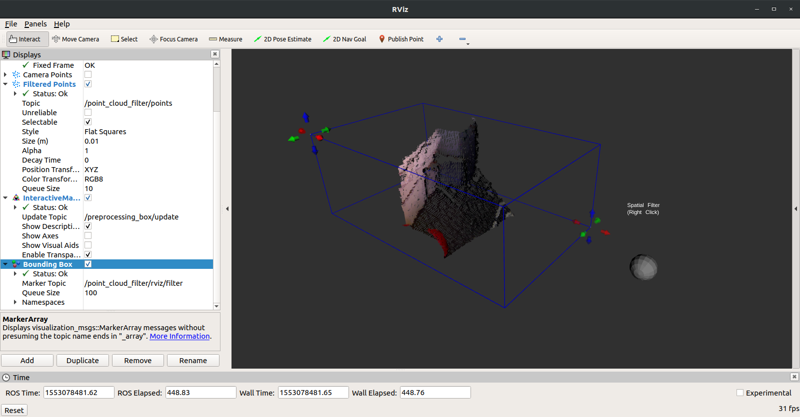

# Point Cloud Spatial Filter

This package filters one big point cloud (from a kinect, xtion, etc) and gives the only the points inside a desired region, defined by interactive markers.



# Usage

An example launch file:

```xml
<?xml version="1.0"?>
<launch>

    <arg name="configure" default="false"/>

    <node pkg="point_cloud_spatial_filter" type="point_cloud_spatial_filter_node" name="point_cloud_filter" output="screen" required="true">

        <param name="point_cloud_in" value="/camera/depth_registered/points"/>
        <param name="fixed_frame_id" value="/camera_link"/>

        <param name="configure" value="$(arg configure)"/>
        <param name="voxelize" value="true"/>
        
        <rosparam unless="$(arg configure)" file="$(find point_cloud_spatial_filter)/params/default_params.yaml" command="load" />    
        
        <!-- If you want to overwrite the defaults  
        <param name="x_voxel" value="0.01"/>
        <param name="y_voxel" value="0.01"/>
        <param name="z_voxel" value="0.01"/>

        <param name="x_max" value="0.2"/>
        <param name="y_max" value="0.2"/>
        <param name="z_max" value="0.2"/>
        <param name="x_min" value="-0.2"/>
        <param name="y_min" value="-0.2"/>
        <param name="z_min" value="-0.2"/> -->

    </node>

</launch>
```

configure: if false will load saved parameters, if true will load interactive markers to define the region
voxelize: converts point cloud to voxels center points

To save the current configuration just click in the grey sphere. They'll be stored at $(find point_cloud_spatial_filter)/params/default_params.yaml.