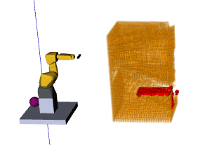

# World Model Consistency Check

A package to compare two octrees.

## Accumulated Point Cloud 2 File

This node is able to create an accumulated point cloud. 


To launch this node implement in your launch file:

```xml
<node if="$(arg record)" pkg="world_model_consistency_check" type="accumulatepointcloud2file" name="accumulatedpointcloud2file" output="screen">
    <remap from="input" to="camera/depth_registered/points"/>
    <param name="~filename" value="/home/*your_user*/auto_save.pcd" type="str"/>
    <remap from="map" to="base_link"/>
</node>
 ```

## Octomap Bounding Box

This node subscribes the "/octomap_full" topic from Octomap Server, then publishes:

    - visualization_msgs::MarkerArray with free, occupied and unknown voxels (cubes) for visualization
    - sensor_msgs::PointCloud2 with the centers of the unknown voxels 
    - octomap_msgs::Octomap where the voxels marked as free are actually unknown in the original Octomap
    - visualization_msgs::MarkerArray containing the wireframe of the region


